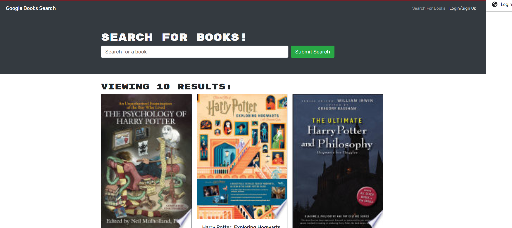

# Book Search Engine 

# 
[
    
## [Description](table-of-conents)

This is a MERN STACK application that allows users to sign up, login, search and save books to be read later .  

## Table of Contents 

* [Installation](#installation)
* [Usage](#usage)
* [Credits](#credits)
* [License](#license)
* [Contribute](#contribute)
* 

## [Installation](#table-of-contents)

this project does not need to be installed

## [Usage](#table-of-contents)

1. go to the deployed site 
2. sign up 
3. search for any books you desire and save them to read later
[Visit the live site here!](https://dry-oasis-15794.herokuapp.com/)

## [Credits](#table-of-contents)

this app uses:
- Mongoose, Mongodb  
- Express 
- React 
- Node.js
- Apollo 
- GraphQl 

## [License](#table-of-contents)

This project is licensed by 
[mit](https://choosealicense.com/licenses/mit)

    

## [Contribute](#table-of-contents)

Contact me if you would like to contribute 

## [Questions](#table-of-contents)

Contact me through [e-mail](mailto:marquez.jay444@gmail.com)

Connect with me through [GitHub.](https://www.github.com/Jay-MM)

